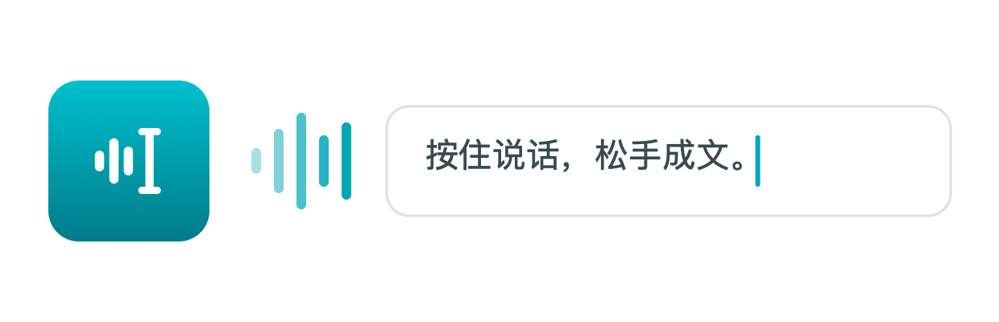

<div align="center">
  <picture>
    <source media="(prefers-color-scheme: dark)" srcset="docs/images/hero-dark.png">
    
  </picture>
  <h1>MiVibe</h1>
  <p><strong>Hold to talk. Release to write.</strong></p>
  <p>Turn a Xiaomi Bluetooth voice remote into your Mac's voice input and control device.</p>
  <p>Works with the Xiaomi Bluetooth voice remote (VID 0x2717 / PID 0x32B8).</p>
  <p>
    
    
    
    
  </p>
  <p><a href="README.md">中文</a> · <strong>English</strong> · <a href="#download-and-install">Download</a> · <a href="#build-from-source">Build from source</a> · <a href="AGENTS.md">Contributing (Chinese)</a></p>
</div>

---

## Your remote. Your voice. Your Mac.

**MiVibe turns a Xiaomi Bluetooth voice remote into a native Mac input and control device.** Focus a text field, hold the voice key, speak, and release to insert the transcription. It lives in the menu bar, with a floating status indicator that keeps your text field focused.

Voice input never submits a message automatically. If focus changes after recording starts, MiVibe holds the result for you to insert explicitly.

## What it does

- **Cloud or local recognition:** Doubao speech recognition or whisper.cpp on your Mac. Local recognition works offline once a model is downloaded and never falls back to the cloud automatically.
- **Keyword corrections:** fix recurring errors in names and technical terms with a shared replacement list.
- **Optional rewriting:** keep the original text by default, or choose cleanup, formal writing, concision, Chinese-to-English translation, Vibe Coding, or custom prompts. Rewrite failures fall back to the original text.
- **Remote key mapping:** configure shortcuts and in-app actions globally or per application. Voice and power keys remain reserved.
- **Ordered recovery:** up to two outstanding items, inserted in recording order. A failed item blocks later input until resolved.

The coding-assistant preset maps confirm to Return, back to Esc, and up/down to Page Up/Down. The target application determines what those shortcuts do.

## Download and install

Download `MiVibe-<version>-arm64.dmg` from [Releases](https://github.com/taliove/mi-vibe/releases/latest), open it, and drag MiVibe into Applications.

Release builds are not notarized. On first launch macOS says the developer cannot be verified: open System Settings → Privacy & Security and click "Open Anyway", or remove the download quarantine flag:

```sh
xattr -dr com.apple.quarantine /Applications/MiVibe.app
```

Release builds are ad-hoc signed by CI, so each version has a different signature and you may need to re-enable Accessibility and Input Monitoring after upgrading. To keep permissions across updates, build from source with a stable local signing identity as described below.

## Build from source

The current build targets **Apple Silicon with Swift 6.0** and supports a Command Line Tools workflow without full Xcode. The deployment target is macOS 14.0; the repository records hardware verification on macOS 26.5.2. Other OS versions are not thereby verified. The tested remote is VID `0x2717` / PID `0x32B8`, firmware 2671.

Run from the repository root:

```sh
Scripts/setup-signing.sh       # One-time local signing identity
Scripts/build-app.sh release   # Fetch dependency if missing, build, bundle, sign
open build/MiVibe.app
```

To rebuild and install, use `Scripts/deploy.sh release`. It closes MiVibe and replaces `/Applications/MiVibe.app`. Signing uses `MIVIBE_SIGN_IDENTITY`, then the local identity, then ad-hoc signing as a fallback. A stable identity helps preserve macOS privacy grants across rebuilds.

1. Pair the remote in System Settings → Bluetooth.
2. Open MiVibe Settings → Recognition (识别). Configure a Doubao API Key for resource `volc.seedasr.sauc.duration`, or download and select a local model.
3. Grant Bluetooth and Accessibility access, plus event posting when requested. Key takeover also requires Input Monitoring to read the remote; it applies a per-device key remap so macOS stops acting on the remote's keys, and removes it when takeover is turned off or MiVibe quits. If the remote's keys stop working after a crash, relaunch MiVibe or reconnect the remote.
4. Focus a text field, hold the voice key, speak, and release. Configure optional rewriting under 改写, enable key takeover under 遥控器, and edit key mappings under 按键映射.

Initial local recognition may be slower while the model loads and GPU kernels compile. Pending results are available from the menu bar; choose “输入到这里” to insert at the field you select.

## Privacy and scope

Doubao receives recorded audio **after recording ends**. Local recognition with the original-text mode processes speech on-device once the model is available. Enabling a configured LLM rewrite service sends recognized text and relevant prompts, including keyword corrections, to that provider—even when recognition is local. The remote's physical voice key gates audio capture; MiVibe does not use the Mac microphone.

API keys are stored in plaintext at `~/.config/mivibe/config.json` with `0600` permissions in a `0700` directory, not in Keychain. Pending text or failed recordings use `pending.json` in the same directory, also plaintext with `0600` permissions, and are read then deleted on startup. Audio persistence has a 4 MiB budget; exceeding it retains text only. Models are downloaded on demand to `~/Library/Application Support/MiVibe/models/` and verified with SHA256. There is no long-term recording archive.

This is a personal-use, non-sandboxed, non-notarized application; the repository does not include an open-source license. Input compatibility requires per-app verification. Secure text fields reject injection, and terminal paste execution is outside the current compatibility promise.

## Development

```sh
Scripts/fetch-whisper.sh
swift build
swift run MiVibeTests
```

Tests use a custom executable harness, not `swift test`. Read [AGENTS.md](AGENTS.md) for shared engineering rules, [CLAUDE.md](CLAUDE.md) for the Claude Code entry point, [SPEC.md](SPEC.md) for the product contract, and [CONTEXT.md](CONTEXT.md) for domain terms. Engineering documentation is primarily in Chinese.

---

中文版：[README.md](README.md)
