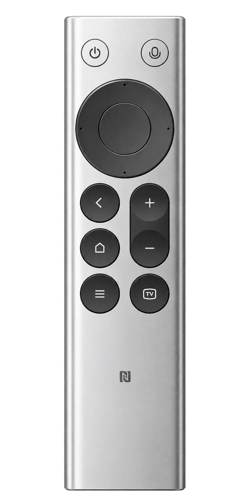

<div align="center">
  
  <h1>MiVibe</h1>
  <p><strong>按住说话，松手成文。</strong><br>Hold to talk. Release to write.</p>
  <p>让小米遥控器，成为 Mac 的语音输入与操作入口。</p>
  <p>
    
    
    
  </p>
  <p><a href="#中文">中文</a> · <a href="#english">English</a> · <a href="#快速开始">快速开始</a> · <a href="AGENTS.md">开发协作</a></p>
</div>

---

<a id="中文"></a>

## 一只遥控器，把想法写进 Mac

MiVibe 是常驻菜单栏的 macOS 原生应用。把光标放进输入框，按住小米蓝牙遥控器的语音键说话，松开后，识别结果便写入目标位置。写消息、记想法，或向编程助手描述下一步，都可以从一句话开始。

**输入与发送分开。** 语音输入不会自动按下回车；你可以检查文字，再用遥控器确认键或键盘提交。录音后若切换了输入框，MiVibe 会暂存结果，等待你选择「输入到这里」。

### 说、写、操作，都在手边

| 能力 | 使用体验 |
| --- | --- |
| 按住说话 | 音频来自遥控器麦克风，由实体语音键控制；浮条展示录音、转写、整理与待处理状态，不抢输入焦点。 |
| 两种识别引擎 | 豆包语音提供云端识别；whisper.cpp 在 Mac 上本地转写，下载模型后可离线使用。 |
| 关键词纠正 | 为人名、产品名、技术术语维护「误识别 → 正确写法」，两个引擎都生效。 |
| 可选文字改写 | 默认「原文直出」；也可选转录整理、正式书面、简洁、翻译为英文、Vibe Coding，或自定义提示词。失败时回落原文。 |
| 遥控器按键映射 | 按默认或指定应用配置快捷键与 MiVibe 内部动作。语音键与电源键不开放改绑。 |
| 按序输入与恢复 | 最多容纳两条未处理内容，按录音顺序输入。前一条失败会阻塞后续，供你重试、恢复输入或丢弃。 |

编程助手预设：**确认 → Return · 返回 → Esc · 上 / 下 → 翻页**。实际发送、打断行为取决于目标应用对这些快捷键的定义；预设应用后仍可编辑。

## 快速开始

### 1. 准备设备与识别方式

- **Mac：** 当前构建面向 Apple Silicon，使用 Swift 6.0 工具链；安装 macOS Command Line Tools 即可按仓库流程构建，无需完整 Xcode。
- **系统：** `Package.swift` 与应用包声明最低 macOS 14.0；仓库记录的真机验证环境为 macOS 26.5.2（Apple Silicon）。最低部署目标不等于所有版本都已验证。
- **遥控器：** 小米蓝牙语音遥控器，VID `0x2717` / PID `0x32B8`、固件 2671。当前兼容验证仅覆盖这一型号。
- **识别方式二选一：** 豆包需 API Key（资源 `volc.seedasr.sauc.duration`）；本地识别需在应用内下载并选用模型。

### 2. 从源码构建

在仓库根目录执行：

```sh
# 首次设置固定的本地签名身份，便于后续构建沿用系统授权
Scripts/setup-signing.sh

# 构建、组装并签名，产物为 build/MiVibe.app
# 缺少 whisper.cpp 源码时会自动下载并校验
Scripts/build-app.sh release

open build/MiVibe.app
```

需要安装到应用程序目录时，执行：

```sh
# 关闭运行中的 MiVibe，重新构建，替换 /Applications/MiVibe.app 并启动
Scripts/deploy.sh release
```

构建脚本优先使用 `MIVIBE_SIGN_IDENTITY` 指定的身份，其次使用本地 `MiVibe Local Signing`，两者均未配置时退回 ad-hoc 签名。ad-hoc 构建更新后可能需要重新授权；日常使用宜保持固定签名身份。

### 3. 配对、配置、说话

1. 在「系统设置 → 蓝牙」配对遥控器，启动 MiVibe。
2. 从菜单栏打开「设置 → 识别」：选择豆包并填写 API Key，或选择本地识别、下载并选用模型。
3. 按提示授予所需权限，将光标放入目标输入框，按住语音键说话，再松开。
4. 按需在「改写」页配置服务商与模式，在「遥控器」页开启按键接管，在「按键映射」页选择作用范围并录制快捷键。

本地模型首次运行需加载模型并编译 GPU 内核，可能较慢。若浮条提示需要处理，可在菜单栏查看待处理内容，选好输入框后点击「输入到这里」。

### 所需权限

| 权限 | 用途 |
| --- | --- |
| 蓝牙 | 接收遥控器的语音数据。 |
| 辅助功能 | 读取目标输入框、直接写入文字。 |
| 事件投递 | 在需要时模拟粘贴和按键快捷键，由应用预检并请求。 |
| 输入监控 | 按键接管时读取遥控器按键。接管会对这支遥控器写入按键重映射，让系统不再响应；关闭接管或退出 MiVibe 时撤销。若 MiVibe 异常退出后遥控器按键失灵，重新打开 MiVibe 或断开重连遥控器即可恢复。 |

## 你的声音，走哪条路

**遥控器 → 识别 → 关键词纠正 → 可选改写 → 焦点校验 → 输入框**

| 选择 | 数据去向 |
| --- | --- |
| 豆包识别 | 录音结束后，音频发送至豆包语音服务进行转写。 |
| 本地识别 + 原文直出 | 模型准备好后，音频和识别文字在本机处理，无需云端识别或改写。 |
| 任一引擎 + 已配置的改写服务 | 识别文字及相关提示词（含关键词纠正表）发送至所选 LLM 服务商。**本地识别不等于启用改写后仍全程离线。** |

本地识别失败不会自动切换到云端。物理按键控制的是遥控器音频采集，云端请求发生在录音结束后。MiVibe 不使用 Mac 麦克风，不提供长期录音历史。

| 本地数据 | 位置与保存方式 |
| --- | --- |
| 配置与 API Key | `~/.config/mivibe/config.json`，明文 JSON，文件权限 `0600`、目录 `0700`；未使用 Keychain 保存 API Key。 |
| 待处理文字 / 失败录音 | `~/.config/mivibe/pending.json`，明文、`0600`；用于跨重启恢复，启动读取后删除，不是历史归档。音频留存有 4 MiB 上限，超限时仅保留文字。 |
| 本地识别模型 | `~/Library/Application Support/MiVibe/models/`，按需下载并校验 SHA256，不随应用分发。 |

当前按个人使用方式分发，应用未启用沙盒、未公证；仓库未提供开源许可证。输入兼容性需逐应用验证，安全输入框拒绝注入，终端粘贴执行行为不在当前兼容承诺内。

## 开发与文档

```sh
Scripts/fetch-whisper.sh   # 首次拉取固定版本的 whisper.cpp，校验 SHA256
swift build               # 构建所有目标
swift run MiVibeTests      # 自带断言的可执行测试套件
```

测试使用仓库内的 `Harness`，入口是 `Tests/MiVibeTests/main.swift`，不走 `swift test`。硬件与服务诊断入口为 `Sources/MiVibeProbes/main.swift`；运行前先查看参数与所需权限。

| 路径 | 内容 |
| --- | --- |
| [Sources/MiVibe](Sources/MiVibe) | SwiftUI / AppKit 界面与主流程编排。 |
| [Sources/MiVibeCore](Sources/MiVibeCore) | 音频、识别、改写、队列、按键路由与系统集成。 |
| [Tests/MiVibeTests](Tests/MiVibeTests) | 可执行测试与断言工具。 |
| [AGENTS.md](AGENTS.md) / [CLAUDE.md](CLAUDE.md) | AI 协作规范 / Claude Code 入口。 |
| [SPEC.md](SPEC.md) / [CONTEXT.md](CONTEXT.md) | 产品与技术规格 / 领域术语。规格含早期基线与后续增补，当前行为需对照源码。 |
| [docs/adr](docs/adr) | 架构决策记录。 |
| [.scratch/mivibe](.scratch/mivibe) | 已入库的研究、票据与真机证据。 |

---

<a id="english"></a>

## English

### Your remote. Your voice. Your Mac.

**MiVibe turns a Xiaomi Bluetooth voice remote into a native Mac input and control device.** Focus a text field, hold the voice key, speak, and release to insert the transcription. It lives in the menu bar, with a floating status indicator that keeps your text field focused.

Voice input never submits a message automatically. If focus changes after recording starts, MiVibe holds the result for you to insert explicitly.

### What it does

- **Cloud or local recognition:** Doubao speech recognition or whisper.cpp on your Mac. Local recognition works offline once a model is downloaded and never falls back to the cloud automatically.
- **Keyword corrections:** fix recurring errors in names and technical terms with a shared replacement list.
- **Optional rewriting:** keep the original text by default, or choose cleanup, formal writing, concision, Chinese-to-English translation, Vibe Coding, or custom prompts. Rewrite failures fall back to the original text.
- **Remote key mapping:** configure shortcuts and in-app actions globally or per application. Voice and power keys remain reserved.
- **Ordered recovery:** up to two outstanding items, inserted in recording order. A failed item blocks later input until resolved.

The coding-assistant preset maps confirm to Return, back to Esc, and up/down to Page Up/Down. The target application determines what those shortcuts do.

### Build and use

The current build targets **Apple Silicon with Swift 6.0** and supports a Command Line Tools workflow without full Xcode. The deployment target is macOS 14.0; the repository records hardware verification on macOS 26.5.2. Other OS versions are not thereby verified. The tested remote is VID `0x2717` / PID `0x32B8`, firmware 2671.

Run from the repository root:

```sh
Scripts/setup-signing.sh       # One-time local signing identity
Scripts/build-app.sh release   # Fetch dependency if missing, build, bundle, sign
open build/MiVibe.app
```

To rebuild and install, use `Scripts/deploy.sh release`. It closes MiVibe and replaces `/Applications/MiVibe.app`. Signing uses `MIVIBE_SIGN_IDENTITY`, then the local identity, then ad-hoc signing as a fallback. A stable identity helps preserve macOS privacy grants across rebuilds.

1. Pair the remote in System Settings → Bluetooth.
2. Open MiVibe Settings → Recognition (识别). Configure a Doubao API Key for resource `volc.seedasr.sauc.duration`, or download and select a local model.
3. Grant Bluetooth and Accessibility access, plus event posting when requested. Key takeover also requires Input Monitoring to read the remote; it applies a per-device key remap so macOS stops acting on the remote's keys, and removes it when takeover is turned off or MiVibe quits. If the remote's keys stop working after a crash, relaunch MiVibe or reconnect the remote.
4. Focus a text field, hold the voice key, speak, and release. Configure optional rewriting under 改写, enable key takeover under 遥控器, and edit key mappings under 按键映射.

Initial local recognition may be slower while the model loads and GPU kernels compile. Pending results are available from the menu bar; choose “输入到这里” to insert at the field you select.

### Privacy and scope

Doubao receives recorded audio **after recording ends**. Local recognition with the original-text mode processes speech on-device once the model is available. Enabling a configured LLM rewrite service sends recognized text and relevant prompts, including keyword corrections, to that provider—even when recognition is local. The remote's physical voice key gates audio capture; MiVibe does not use the Mac microphone.

API keys are stored in plaintext at `~/.config/mivibe/config.json` with `0600` permissions in a `0700` directory, not in Keychain. Pending text or failed recordings use `pending.json` in the same directory, also plaintext with `0600` permissions, and are read then deleted on startup. Audio persistence has a 4 MiB budget; exceeding it retains text only. Models are downloaded on demand to `~/Library/Application Support/MiVibe/models/` and verified with SHA256. There is no long-term recording archive.

This is a personal-use, non-sandboxed, non-notarized application; the repository does not include an open-source license. Input compatibility requires per-app verification. Secure text fields reject injection, and terminal paste execution is outside the current compatibility promise.

### Development

```sh
Scripts/fetch-whisper.sh
swift build
swift run MiVibeTests
```

Tests use a custom executable harness, not `swift test`. Read [AGENTS.md](AGENTS.md) for shared engineering rules, [CLAUDE.md](CLAUDE.md) for the Claude Code entry point, [SPEC.md](SPEC.md) for the product contract, and [CONTEXT.md](CONTEXT.md) for domain terms. Engineering documentation is primarily in Chinese.
